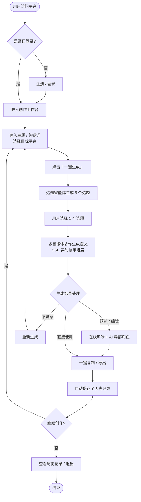
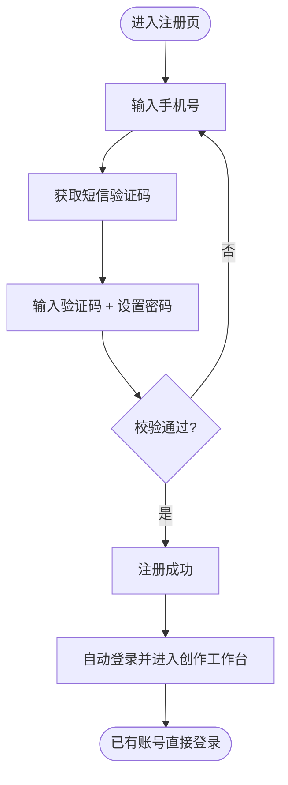
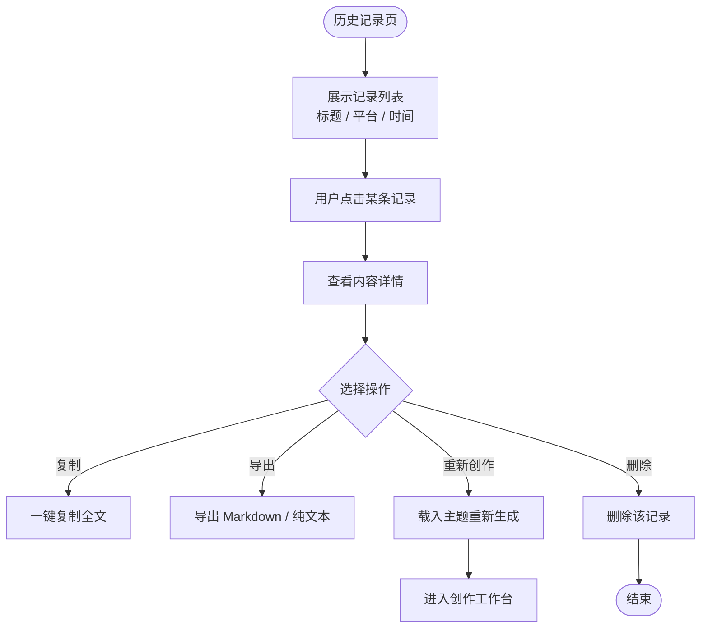

# AI 爆文智能创作平台 - 最终版需求分析报告

> **版本**：v1.0（合成版） | **更新日期**：2026-07-31
> **文档来源**：《AI爆文智能创作平台-完整需求分析文档》+《需求分析opencode版本》
> **项目定位**：面向自媒体创作者的多智能体协作 + 多模态内容生成 SaaS 平台
> **技术栈**：Python + FastAPI + LangGraph + SSE + Vue3 + 通义千问 + MySQL + Redis

---

## 1. 需求背景

### 1.1 行业现状

中国自媒体创作者规模已突破 **2000 万以上**（2024-2026 年活跃创作者约 3500 万），覆盖小红书、公众号、知乎、抖音、B站等主流平台，日均产生内容超过 5000 万条。但创作者面临的核心矛盾是：

> **内容需求无限增长 vs 创作效率严重受限**

| 平台 | 日均内容需求量 | 创作者平均产出 | 内容缺口 |
|------|--------------|--------------|---------|
| 小红书 | 3000 万+ 笔记 | 2-3 篇/天 | 高质量内容严重不足 |
| 公众号 | 500 万+ 文章 | 1-2 篇/天 | 10 万+ 爆文极难持续产出 |
| 抖音 | 1 亿+ 短视频 | 3-5 条/天 | 文案创意枯竭 |
| 知乎 | 200 万+ 回答 | 1-2 条/天 | 专业深度内容稀缺 |

**数据支撑**：
- 中国内容创作工具市场 2025 年预计突破 **500 亿元**，AI 写作工具年复合增长率 > 80%
- **78%** 的创作者每周创作时间超过 20 小时，但只有 **12%** 的内容能获得 10 万+ 阅读量
- **65%** 的创作者表示"选题困难、不知道写什么"
- **73%** 的创作者表示"不懂平台爆文逻辑，流量无法预测"
- **81%** 的创作者表示"配图、排版耗时严重，占据创作时间 40% 以上"
- **72%** 的创作者愿意为效率工具付费（月均 50-200 元）

### 1.2 真实行业痛点

| # | 痛点 | 场景描述 | 根本原因 |
|---|------|---------|---------|
| 1 | **选题焦虑症** | 每天花 1-3 小时刷热点找选题，仍不知道写什么 | 缺乏数据驱动的选题决策能力，靠"灵感"创作 |
| 2 | **爆文逻辑黑箱** | 同样主题别人 10 万+，自己写无人问津 | 不懂爆文底层逻辑（情绪钩子、结构框架、节奏控制、标题公式） |
| 3 | **写作效率低下** | 一篇 2000 字文章需 4-6 小时，日更压力巨大 | 从构思到成稿全流程手工操作，无自动化工具 |
| 4 | **配图成本高昂** | 找图耗时 30 分钟+，版权图贵，自己作图不专业 | 缺乏 AI 配图能力，不懂设计工具 |
| 5 | **排版规范缺失** | 各平台排版要求不同，手动调整耗时且不美观 | 不了解各平台排版规范，无统一排版工具 |
| 6 | **SEO 意识薄弱 / 不涨粉** | 内容质量不错但搜索排名低，流量无法预测 | 不懂关键词布局、标题优化，无法提炼可复制的爆文要素 |

### 1.3 现有解决方案的不足

| 方案 | 优点 | 缺点 |
|------|------|------|
| 纯人工创作 | 质量高、个性化强 | 效率低、成本高、无法规模化 |
| 传统 AI 写作工具（Jasper / Copy.ai / 秘塔写作猫） | 速度快、成本低 | 单次调用质量不稳定、通用模板、无爆文逻辑、无配图、无平台适配 |
| 通用大模型（ChatGPT / Claude / 通义千问） | 智能化程度高 | 需精细化 Prompt、无全流程自动化、无多模态融合、无平台适配 |

### 1.4 项目定位与核心价值主张

从"人找内容"到"内容找人"，通过 **多智能体协作 + 多模态生成** 实现全自动爆文创作：

| 传统创作模式 | 本平台模式 | 价值提升 |
|------------|----------|---------|
| 选题靠灵感（1-3 小时） | AI 数据驱动选题（秒级） | 效率提升 99% |
| 写作靠手感（4-6 小时） | 多智能体协作生成（约 80 秒） | 效率提升 95% |
| 配图靠素材库（30 分钟+） | AI 多模态自动配图（1 分钟内） | 效率提升 98% |
| 排版靠经验（20 分钟+） | 智能排版一键生成（秒级） | 效率提升 99% |
| 质量靠直觉 | AI 质量审核 + 优化 | 质量提升 60% |

**技术差异化亮点**：
1. 多智能体协作（LangGraph 状态机编排），非简单 GPT 套壳
2. SSE 流式输出，实时展示创作过程
3. 多模态融合（文本 + 图像）一站式生成
4. 平台风格策略（小红书/知乎/公众号/抖音）

### 1.5 目标用户画像

| 用户群体 | 占比 | 典型画像 | 付费意愿 | 客单价接受范围 |
|---------|------|---------|---------|---------------|
| 自媒体个人创作者 | 60% | 22-35 岁，1000-10 万粉丝 | ★★★★ | 99-199 元/月 |
| 新媒体运营从业者 | 25% | 25-40 岁，管理 3-10 个账号 | ★★★★★ | 199-999 元/月 |
| MCN 机构 / 内容工作室 | 10% | 3-50 人团队，月产 1000+ 篇 | ★★★★★ | 999-9999 元/月 |
| 副业探索者 | 5% | 上班族 / 宝妈，时间碎片化 | ★★★ | 99 元/月 |

---

## 2. MVP 最小可行功能点

### 2.1 MVP 设计原则

> **目标**：只做一条核心主线，2-3 周内一口气完成，快速验证"输入主题 → 一键生成爆文 → 编辑/导出"的核心价值闭环。

1. **只做单篇创作**：不做批量、不做逆向分析、不做多版本生成
2. **简化智能体**：8 个智能体收敛为 **5 个核心智能体 + 1 个基础质量检查**（配图、深度 SEO、深度审核后置）
3. **简化商业化**：暂不接支付、不做会员体系、不做后台管理
4. **简化基础设施**：暂不引入 Celery 异步队列，同步 + 流式输出即可
5. **平台风格**：先内置 3 个风格模板（小红书 / 公众号 / 知乎），抖音后置

### 2.2 MVP 功能清单

#### A. 用户系统（简化版）
- [ ] 注册 / 登录（手机号 + 验证码，或用户名 + 密码）
- [ ] 个人信息（昵称、头像）
- [ ] JWT 登录态管理

#### B. 创作工作台（核心）
- [ ] 主题 / 关键词输入
- [ ] 目标平台选择（小红书 / 公众号 / 知乎）
- [ ] 一键生成（触发多智能体协作流程）
- [ ] SSE 流式输出，实时展示各智能体工作进度
- [ ] 结果预览（标题 + 正文 + 平台风格排版）
- [ ] 在线编辑（富文本编辑 + AI 局部润色按钮）
- [ ] 一键复制 / 导出（Markdown、纯文本）

#### C. 多智能体创作流程（核心）
- [ ] **选题智能体**：输入关键词 → 生成 5 个爆款选题（标题、简介、目标人群），用户选择 1 个
- [ ] **爆文逻辑分析智能体**：输出标题钩子、开头 3 秒、内容结构、情绪价值点
- [ ] **文案创作智能体**：生成 3 个备选标题 + 正文初稿（SSE 流式输出）
- [ ] **润色优化智能体**：语言口语化、增强情绪价值、适配平台风格
- [ ] **排版整合智能体**：按平台风格排版（短句 + Emoji / 长段落 / 小标题）
- [ ] **基础质量检查**：敏感词过滤 + 生成审核提示

#### D. 历史记录
- [ ] 自动保存生成记录（标题、平台、时间、内容）
- [ ] 历史列表查看 / 详情查看 / 复制 / 删除

### 2.3 MVP 明确不做（后置项）

| 后置功能 | 原因 |
|---------|------|
| AI 自动配图 | 需接入通义万相 + OSS 存储 + CDN，复杂度高 |
| 批量内容生成 | 需 Celery 异步任务队列 |
| 爆文逆向分析 | 需爬虫 + 数据解析，属学习型功能 |
| 一键多平台适配（多版本生成） | 属效率增强功能 |
| 会员与支付系统 | 商业化后置 |
| 后台管理系统 | 运营后置 |
| 数据看板 / 统计 | 需数据沉淀后才有意义 |

### 2.4 MVP 验收标准

- 用户可完整走通：**注册登录 → 输入主题选平台 → 一键生成 → 实时看进度 → 预览编辑 → 复制/导出 → 历史记录可查**
- 单篇生成总耗时 < 120 秒
- 生成内容无敏感词，平台风格排版正确
- 历史记录可正确保存、读取、删除

---

## 3. 后续可做的扩展功能点（按优先级）

### 3.1 优先级总览

| 优先级 | 时间窗口 | 说明 |
|--------|---------|------|
| **P0** | MVP 上线后立即做（1-2 周） | 补全核心差异化能力，提升付费意愿 |
| **P1** | 中期（3-6 周） | 完整商业化 + 规模化能力 |
| **P2** | 后期（6-12 周） | 运营与管理能力 |
| **P3** | 长期（持续迭代） | 生态化、国际化、多元化 |

### 3.2 P0 优先（补全核心能力）

| # | 功能 | 说明 |
|---|------|------|
| 1 | **AI 自动配图** | 根据内容语义生成 3-5 张配图（通义万相 + OSS + CDN），风格可选，单张可重新生成 |
| 2 | **一键多平台适配** | 同一篇内容生成小红书/知乎/公众号/抖音多平台版本，一键切换风格 |
| 3 | **深度 SEO 优化** | 关键词密度优化、话题标签生成、Meta 描述、标题 SEO |
| 4 | **完整质量审核** | 敏感词 + 逻辑一致性 + 格式检查，输出质量评分报告 |
| 5 | **爆文逆向分析** | 输入爆文链接/内容，AI 拆解标题钩子、情绪曲线、内容结构，输出分析报告 |

### 3.3 P1 优先（商业化 + 规模化）

| # | 功能 | 说明 |
|---|------|------|
| 1 | **批量内容生成** | 上传选题表（Excel/CSV）批量生成，Celery 异步队列 + 进度展示 |
| 2 | **会员与支付系统** | 免费/基础/专业/企业四级套餐，微信/支付宝支付，会员权益控制 |
| 3 | **历史记录增强** | 收藏、搜索、重新编辑、按平台筛选 |
| 4 | **热点追踪接入** | 微博热搜 / 百度指数 API，热点选题推荐 + 选题热度评分 |
| 5 | **内容模板库** | 内置各平台爆文结构模板，一键套用 |
| 6 | **数据看板** | 创作数量/字数统计、节省时间、效率趋势（个人侧） |

### 3.4 P2 优先（运营与管理）

| # | 功能 | 说明 |
|---|------|------|
| 1 | **后台管理系统** | 用户管理、订单管理、内容审核、套餐配置、系统监控、日志管理 |
| 2 | **营收数据统计** | 总营收/趋势图、支付渠道分布、会员转化率/续费率 |
| 3 | **内容运营** | 用户生成内容列表、违规内容审核、人工复审 |
| 4 | **Prompt 版本管理** | 各智能体 Prompt 版本控制 + A/B 测试 |

### 3.5 P3 长期（生态扩展）

| # | 功能 | 说明 |
|---|------|------|
| 1 | **开放 API（B 端）** | 面向 MCN/工作室按调用次数计费 |
| 2 | **多内容形态** | 视频脚本、直播文案、电商带货文案 |
| 3 | **更多平台** | B站、快手、视频号 |
| 4 | **插件生态** | Chrome 插件、Word 插件、飞书/钉钉机器人 |
| 5 | **国际化** | 英文内容生成、海外平台（Medium/LinkedIn）、Stripe 支付 |
| 6 | **爆文数据飞轮** | 沉淀爆文案例库，微调模型形成数据护城河 |

---

## 4. 用户操作流程图（Mermaid）

### 4.1 用户主流程总览

### 4.2 注册 / 登录流程

### 4.3 单篇爆文创作流程（多智能体协作）

### 4.4 历史记录管理与复用

### 4.5 扩展功能流程（MVP 后）

---

## 5. 需求功能核对清单（Task 列表）

### 阶段 1：MVP 核心闭环（本期一口气完成）

- [ ] **用户系统**
  - [ ] 注册 / 登录接口（手机号验证码 或 用户名密码）
  - [ ] 个人信息管理（昵称、头像）
  - [ ] JWT 登录态校验
  - [ ] 前端注册 / 登录页面

- [ ] **创作工作台**
  - [ ] 主题 / 关键词输入框
  - [ ] 目标平台选择器（小红书 / 公众号 / 知乎）
  - [ ] 「一键生成」按钮与交互
  - [ ] SSE 流式进度展示（各智能体步骤 + 进度百分比）
  - [ ] 结果预览（标题 + 正文 + 平台排版样式）
  - [ ] 在线编辑器（可编辑 + AI 局部润色）
  - [ ] 一键复制、导出 Markdown / 纯文本

- [ ] **多智能体创作流程（后端）**
  - [ ] 选题智能体：生成 5 个选题（标题 / 简介 / 目标人群）
  - [ ] 爆文逻辑分析智能体：标题钩子 / 开头 3 秒 / 内容结构 / 情绪点
  - [ ] 文案创作智能体：3 个备选标题 + 正文初稿（SSE 流式）
  - [ ] 润色优化智能体：口语化 + 情绪增强 + 平台风格适配
  - [ ] 排版整合智能体：3 套平台风格模板（小红书 / 公众号 / 知乎）
  - [ ] 基础质量检查：敏感词过滤
  - [ ] LangGraph 状态机编排 + 异常处理（某智能体失败可重试）

- [ ] **历史记录**
  - [ ] 生成记录自动保存（标题、平台、内容、时间）
  - [ ] 历史列表 / 详情 / 复制 / 删除
  - [ ] 前端历史记录页面

- [ ] **基础设施**
  - [ ] FastAPI 项目骨架 + 配置管理
  - [ ] 数据库表结构（users / creation_tasks / contents） + 迁移脚本
  - [ ] 通义千问 API 封装（文本生成）
  - [ ] 前端项目骨架（Vue3 + Vite + Pinia + Element Plus）
  - [ ] 单元测试（核心智能体 + 关键接口）
  - [ ] 本地联调通过，一键启动脚本

### 阶段 2：P0 扩展（核心差异化能力）

- [ ] AI 自动配图（通义万相 + OSS + CDN，风格可选，单张重生成）
- [ ] 一键多平台适配（生成多平台版本）
- [ ] 深度 SEO 优化（关键词密度 / 话题标签 / Meta 描述）
- [ ] 完整质量审核（敏感词 + 逻辑一致性 + 格式检查 + 评分报告）
- [ ] 爆文逆向分析（链接 / 内容输入 → 分析报告）

### 阶段 3：P1 扩展（商业化 + 规模化）

- [ ] 批量内容生成（Excel/CSV 导入，Celery 异步队列，进度展示）
- [ ] 会员与支付系统（四档套餐，微信/支付宝支付，权益控制）
- [ ] 历史记录增强（收藏 / 搜索 / 重新编辑 / 平台筛选）
- [ ] 热点追踪接入（微博热搜 / 百度指数，选题热度评分）
- [ ] 内容模板库（各平台爆文结构模板）
- [ ] 个人数据看板（创作量 / 字数 / 节省时间 / 效率趋势）

### 阶段 4：P2 扩展（运营与管理）

- [ ] 后台管理系统（用户 / 订单 / 内容 / 套餐 / 系统配置）
- [ ] 营收统计（总营收 / 趋势 / 渠道分布 / 会员转化率）
- [ ] 内容运营（生成内容列表 / 违规审核 / 人工复审）
- [ ] Prompt 版本管理 + A/B 测试

### 阶段 5：P3 长期（生态扩展）

- [ ] 开放 API（B 端，按调用计费）
- [ ] 多内容形态（视频脚本 / 直播文案 / 电商带货文案）
- [ ] 更多平台支持（B站 / 快手 / 视频号）
- [ ] 插件生态（Chrome / Word / 飞书机器人）
- [ ] 国际化（英文内容 / 海外平台 / Stripe 支付）
- [ ] 爆文数据飞轮（案例库沉淀 + 模型微调）

---

## 附：MVP 验收要点总结

| 验收维度 | 标准 |
|---------|------|
| 主流程 | 注册 → 生成 → 编辑 → 导出 → 历史可查，全链路走通 |
| 生成质量 | 内容通顺、标题吸引人、平台风格正确、无敏感词 |
| 性能 | 单篇生成 < 120 秒，SSE 进度实时可见 |
| 稳定性 | 智能体单点失败可重试不崩溃 |
| 部署 | 本地一键启动，文档完整 |

---

**最终版需求分析报告完成。下一步建议**：按「阶段 1：MVP 核心闭环」的核对清单直接开工，优先打通多智能体创作流程与 SSE 流式输出。
